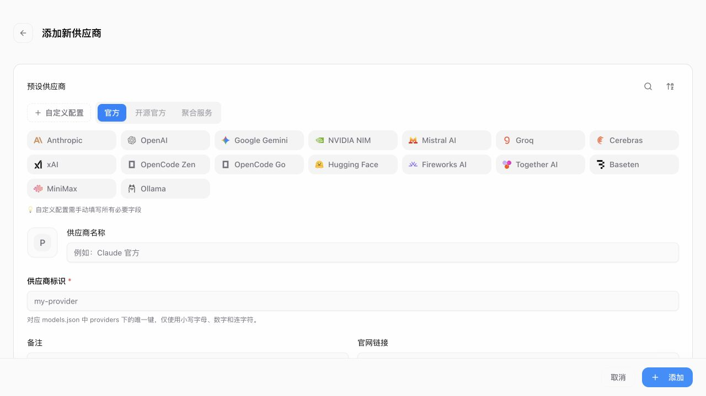
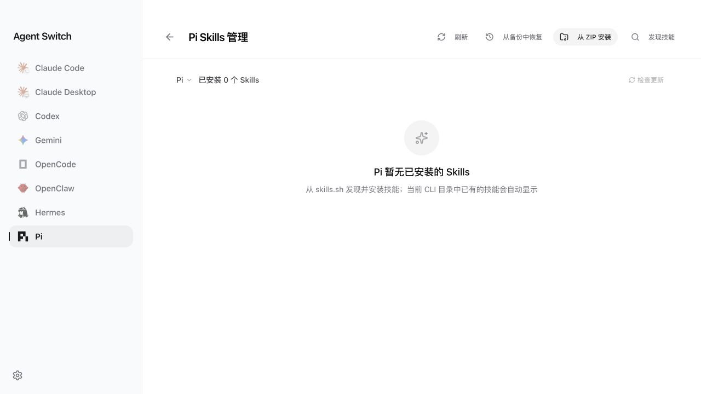
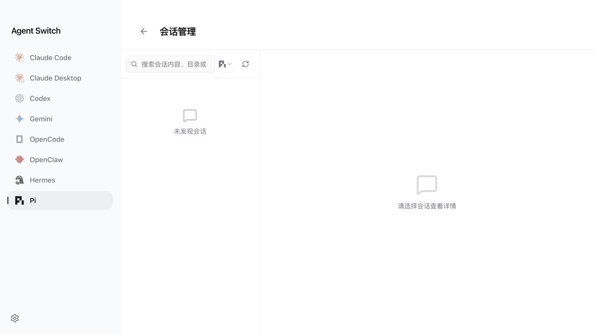

<div align="center">


# Agent Switch

**把散落在各处的 AI 编程客户端配置，收进一个桌面应用**

供应商切换 · 本地路由 · 用量成本 · MCP / Prompt / Skills · 会话管理
一次配好，Claude Code、Codex、Gemini CLI、Pi 等 9 个客户端同时生效

[](https://github.com/qwq202/agent-switch/releases/latest)
[](https://github.com/qwq202/agent-switch/releases)
[](https://github.com/qwq202/agent-switch/releases/latest)
[](https://tauri.app/)
[](LICENSE)

**[⬇️ 下载最新版](https://github.com/qwq202/agent-switch/releases/latest)** · [更新日志](CHANGELOG.md) · [问题反馈](https://github.com/qwq202/agent-switch/issues) · [参与开发](CONTRIBUTING.md)

</div>

---

## 为什么需要它

同时用 Claude Code、Codex、Gemini CLI 和 Pi 的人，大概都经历过这些：

- 换一家中转服务，要手动改 `~/.claude/settings.json`、`~/.codex/config.toml`、`~/.pi/agent/models.json`，格式还各不相同；
- 想知道这个月花了多少钱，得自己翻日志、对着价格表算，而且经过路由重定向后根本分不清实际用的是哪个模型；
- 同一个 MCP Server 要在四个客户端里各配一遍；
- 手滑写坏一个配置文件，客户端直接起不来，也没有可回滚的备份。

Agent Switch 把这些收敛到一个界面里：**配置存在本地 SQLite，配置写盘使用原子替换，Pi 供应商配置与 Skills 在修改前保留轮转备份；切换供应商是一次点击，用量按真实上游模型计费。** 它不托管你的 Key，不需要注册账号，也不往任何服务器上传数据。

## 界面预览

<p align="center">
  
</p>

| Skills 管理                                                           | 会话管理                                                             |
| --------------------------------------------------------------------- | -------------------------------------------------------------------- |
|  |  |

> 截图为当前版本实际运行界面。Skills 与会话页保留真实空状态，未写入示例密钥或伪造数据。

## 支持的客户端

| 客户端             | 供应商切换 | 本地路由 | 用量统计 | MCP | Skills | 会话 |
| ------------------ | :--------: | :------: | :------: | :-: | :----: | :--: |
| **Claude Code**    |     ✅     |    ✅    |    ✅    | ✅  |   ✅   |  ✅  |
| **Claude Desktop** |     ✅     |    ✅    |    ✅    |  —  |   —    |  —   |
| **Codex**          |     ✅     |    ✅    |    ✅    | ✅  |   ✅   |  ✅  |
| **Gemini CLI**     |     ✅     |    ✅    |    ✅    | ✅  |   ✅   |  ✅  |
| **OpenCode**       |     ✅     |    —     |    ✅    | ✅  |   ✅   |  ✅  |
| **OpenClaw**       |     ✅     |    —     |    —     |  —  |   —    |  ✅  |
| **Hermes**         |     ✅     |    —     |    —     | ✅  |   ✅   |  ✅  |
| **Pi**             |     ✅     |    —     |    ✅    |  —  |   ✅   |  ✅  |
| **Grok Build**     |     —      |    —     |    ✅    |  —  |   —    |  ✅  |

各客户端支持的能力以其自身配置格式为准，能力矩阵会随版本更新，具体以应用内实际显示为准。

## 核心能力

### 供应商与本地代理

- 内置官方服务、主流第三方中转的预设，也支持完全自定义 API。
- 一键切换，支持系统托盘快捷操作、拖拽排序、导入导出和 `agentswitch://` Deep Link 分享配置片段。
- 本地代理负责协议格式转换、热切换、自动故障转移、熔断与健康检查——上游挂了自动切走，不用你手动救火。
- Claude、Codex、Gemini 可各自独立启用代理接管，不必把所有客户端绑在同一条路由上；共享代理时停止操作会先检查其他客户端是否还在用。

### 用量与成本

- 基于本地 [Models.dev](https://models.dev/) 元数据缓存计算价格，可按 6 小时 / 每天 / 每周刷新，**你手动设置的价格不会被自动更新覆盖**。
- 计费归属到实际使用的上游模型，而不是客户端请求时写的别名——经过重定向和路由后依然算得准。
- 自动同步 Pi JSONL 中每次模型调用、内嵌工具与摘要生成的供应商、模型、输入 / 输出 / 缓存 Token 和 Pi 原生分项成本。
- 查看请求数、输入 / 输出 / 缓存 Token、成本趋势与逐条请求明细。

### MCP、Prompt 与 Skills

- 在一个界面管理 Claude、Codex、Gemini、OpenCode、Hermes 的 MCP Server，改一次同步到位。
- 管理 `CLAUDE.md`、`AGENTS.md`、`GEMINI.md` 等 Prompt 文件，带回填保护。
- 从 GitHub 仓库或 ZIP 安装 Skills，支持软链接与文件复制两种落地方式；卸载或覆盖前自动创建本地备份。

### 会话与数据安全

- 浏览、搜索、恢复多个客户端的本地会话记录，包括 Pi 的 JSONL 会话树（按当前活动分支展示）。
- 主数据存 SQLite，配置写盘走原子替换；Pi 供应商配置、Skills 以及需要回滚的迁移操作会保留本地备份。
- 可选同步到本地目录、WebDAV 或 S3 兼容对象存储——**同步默认关闭，开不开由你决定**。

## 安装

从 [Releases](https://github.com/qwq202/agent-switch/releases/latest) 下载对应平台的安装包。

| 平台        | 安装包                                                                      |
| ----------- | --------------------------------------------------------------------------- |
| **Windows** | `-Setup.exe` 精简安装版（推荐）· `.msi` 企业部署版 · `-Portable.zip` 便携版 |
| **macOS**   | `.dmg`（推荐）· `.zip`，需 macOS 12+                                        |
| **Linux**   | `.AppImage` · `.deb` · `.rpm`，覆盖 x86_64 与 ARM64                         |

> [!NOTE]
> macOS 版本为未经 Apple 公证的社区构建，首次打开若被拦截，请到「系统设置 → 隐私与安全性」中确认运行。
>
> 请勿用其他仓库的安装包覆盖本应用，否则自动更新来源会发生变化。

## 快速开始

1. 安装并启动 Agent Switch。
2. 在左侧选择要管理的客户端。
3. 添加官方预设或第三方供应商，填写 API Key 与 Base URL（Pi 内置供应商通常只需填 Key）。
4. 检查模型映射后保存，点击「启用」完成切换。
5. 需要故障转移或格式转换时，再开启对应客户端的本地路由接管。
6. **重启目标 CLI 或桌面客户端**，让新配置完整生效。

> [!TIP]
> 首次使用可以直接导入现有客户端配置。如果你已经手工维护了大量自定义字段（尤其是 OpenCode、Codex、Claude 的配置），切换前建议先自行备份一份。

## 数据与隐私

本地优先：所有配置、统计和备份都在你自己的用户目录下，不会因为使用本应用而上传到任何第三方服务器。

| 数据        | 位置                            |
| ----------- | ------------------------------- |
| 主数据库    | `~/.agentswitch/agentswitch.db` |
| 设备设置    | `~/.agentswitch/settings.json`  |
| 自动备份    | `~/.agentswitch/backups/`       |
| Pi 配置备份 | `~/.pi/agent/backups/`          |
| Skills 存储 | `~/.agentswitch/skills/`        |
| Skill 备份  | `~/.agentswitch/skill-backups/` |

启用 WebDAV / S3 同步时，数据会上传到**你自己配置的**远端存储。数据库和备份中包含 API Key 明文，请妥善保管本地文件与同步凭据。

## 开发

需要 Node.js 20+、pnpm 10+、Rust 1.95（以 `rust-toolchain.toml` 为准）及 Tauri 2 平台依赖。

```bash
pnpm install                        # 安装依赖
pnpm dev                            # 启动开发模式（会拉起完整桌面应用）
pnpm typecheck                      # TypeScript 类型检查
pnpm format:check                   # 格式检查
pnpm test:unit                      # 前端单元测试
pnpm build                          # 构建安装包
cd src-tauri && cargo test          # Rust 测试
```

**技术栈**：React + TypeScript + Vite + Tailwind + TanStack Query + shadcn/ui / Tauri 2 + Rust + Tokio + SQLite / Vitest + Cargo Test

```text
src/                    React 前端
├── components/         业务组件与 UI
├── hooks/              前端业务 Hooks
├── lib/api/            Tauri IPC 封装（唯一调用 invoke 的地方）
└── i18n/               界面翻译

src-tauri/src/          Rust 后端
├── commands/           Tauri Command 接口层
├── services/           业务服务
├── database/           SQLite 与 DAO
├── proxy/              本地代理与协议转换
└── session_manager/    会话读取与管理
```

更多架构说明见 [CLAUDE.md](CLAUDE.md) 与 [AGENTS.md](AGENTS.md)。

## 贡献

欢迎 Issue 和 PR。提交前请至少跑通：

```bash
pnpm typecheck && pnpm format:check && pnpm test:unit && (cd src-tauri && cargo test)
```

涉及**供应商路由、用量计费、配置迁移或自动更新**的改动，请在 PR 中说明兼容性影响、测试方法和回滚方式。详见 [CONTRIBUTING.md](CONTRIBUTING.md)。

## 项目渊源

Agent Switch 起步于 [farion1231/cc-switch](https://github.com/farion1231/cc-switch)，在其供应商切换与本地代理的基础上，扩展成了覆盖 9 个客户端的配置、路由、用量与工具管理工具，并新增了 Pi 原生集成、Models.dev 驱动的成本核算、会话管理器重构和独立的多平台发布流程。

- 本项目由 [qwq202/agent-switch](https://github.com/qwq202/agent-switch) 独立维护，安装包、自动更新和问题反馈均走本仓库，**不是上游作者发布的官方版本**。
- 遇到问题请提交到[本仓库 Issues](https://github.com/qwq202/agent-switch/issues)，不要让上游维护者承担本项目的问题。
- 上游的重要修复会在评估兼容性后同步，但不承诺与上游每个提交保持一致。
- 沿用上游 MIT License，感谢 Jason Young 与所有上游贡献者打下的基础。

## License

[MIT License](LICENSE)。原始版权归上游作者所有，二次开发部分由对应贡献者保留其贡献版权。
